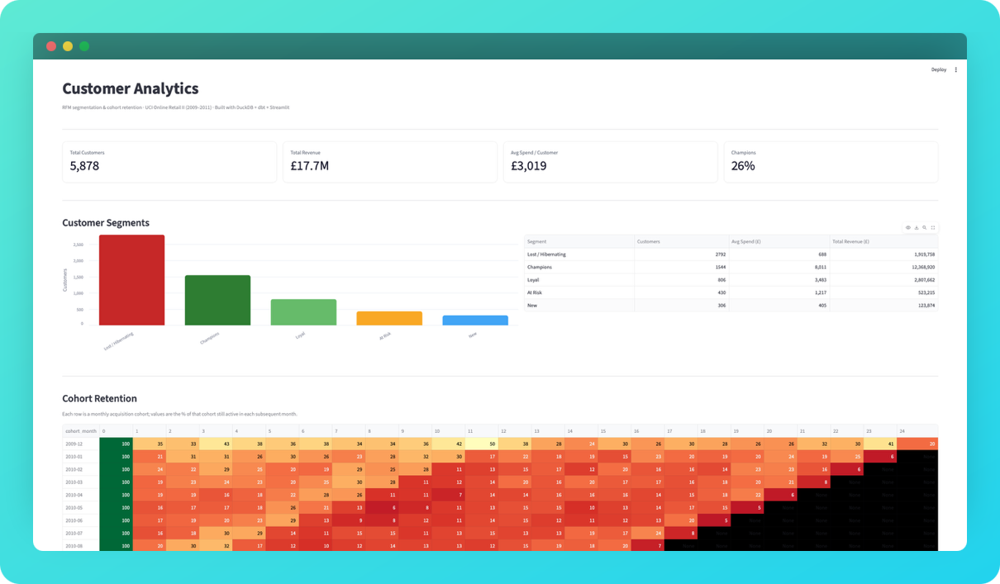

# Customer Analytics Pipeline — RFM Segmentation & Cohort Retention

An end-to-end customer analytics pipeline built on the UCI Online Retail II dataset.
Raw transaction data is cleaned and transformed through a layered dbt pipeline, analyzed
for customer value segments and retention behavior, and presented in an interactive
Streamlit dashboard.



**Stack:** DuckDB (warehouse) · dbt (transformation) · Python/pandas · Streamlit · Altair

---

## Business Problem
Retailers need to know which customers drive value, which are slipping away, and how well
each acquisition cohort retains over time — so marketing spend can be targeted rather than
sprayed across the whole base. This project answers three questions: who are the highest-value
segments, how does retention decay after acquisition, and which customers are worth winning back.

## Dataset
UCI Machine Learning Repository — **Online Retail II** (Dec 2009 – Dec 2011), transactions
from a UK-based online gift retailer. ~1,067,372 rows across 8 fields (invoice, stock code,
description, quantity, date, price, customer ID, country).
[Source](https://archive.ics.uci.edu/dataset/502/online+retail+ii). Not committed to the
repo due to size — download and place in `data/` (see Setup).

## Approach

**1. Cleaning (dbt staging model).** Three documented rules, applied in `stg_transactions`:
- Removed cancelled orders (invoices prefixed `C`) — returns, not sales
- Removed ~243K rows (~23%) with null Customer ID — can't attribute to a customer
- Kept only quantity > 0 and price > 0 — excludes adjustments and freebies

Result: 1.07M rows → ~806K clean sales, losing only 64 of 5,942 customers.

**2. RFM segmentation (`rfm_scores`).** Computed Recency, Frequency, and Monetary per
customer, scored each 1–5 with `NTILE(5)`, and mapped combinations to named segments
(Champions, Loyal, At Risk, New, Lost/Hibernating).

**3. Cohort retention (`cohort_retention`).** Grouped customers by first-purchase month
and tracked the share still active in each subsequent month.

**4. Dashboard.** Streamlit app reading the dbt marts (read-only) with headline metrics,
a segment breakdown, and a retention heatmap.

## Key Findings

<!-- TODO: Write 2–3 findings in your own words. Facts to build from (from your own run):
     - Champions: 1,544 customers (26%), £12.4M of £17.7M total revenue (~70%)
     - Lost/Hibernating: 2,792 customers (~47%), £1.9M revenue (~11%), £688 avg
     - At Risk: 430 customers, £1,217 avg spend, declining recency (win-back target)
     - Retention: 100% month 0 → ~20-35% month 1, then a stable core out to ~12 months -->

Champions drive most of the revenue. They're 1,544 customers (26% of the base) but account for £12.4M of £17.7M total revenue — roughly 70% of revenue from about a quarter of customers.
Nearly half the base has gone quiet. 2,792 customers (about 47%) fall into Lost / Hibernating, contributing only £1.9M (~11%) of revenue at £688 average spend.
At Risk is the win-back target. 430 customers with £1,217 average spend and declining recency — recent enough to re-engage, valuable enough to be worth it.

## Project Structure
```
customer-analytics-pipeline/
├── data/                  # raw dataset (not committed)
├── retail_dbt/            # dbt project (models: staging + marts)
├── app/dashboard.py       # Streamlit dashboard
├── requirements.txt
└── README.md
```

## Setup & Run
1. Create and activate a virtual environment:
   `python3 -m venv venv && source venv/bin/activate`
2. Install dependencies: `pip install -r requirements.txt`
3. Download the dataset into `data/` and run the loader script to build `retail.duckdb`
4. Build the models: `cd retail_dbt && dbt run`
5. Launch the dashboard: `streamlit run app/dashboard.py`

## Limitations
- Guest checkouts (~23% of rows, no Customer ID) are excluded — a revenue-total view
  would handle them differently.
- Later cohorts have truncated retention because the observation window ends Dec 2011.
- RFM thresholds are quintile-based; segment boundaries could be tuned to business needs.